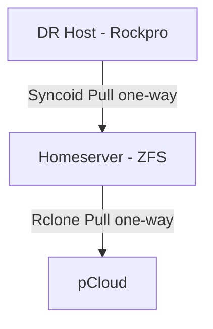

# Backup & Disaster Recovery

Data integrity is non-negotiable. This section outlines the multi-layered strategy used to protect the homelab against everything from accidental `rm -rf` to total site-wide failure.

## The Strategy

We follow a tiered approach to redundancy, moving from high-frequency, low-latency protection to low-frequency, high-latency catastrophic recovery.

## Core Components

- [Three-Layer Strategy](three-layer-strategy.md) — The philosophy of tiered redundancy.
- [DR Host](dr-host.md) — Details on the FreeBSD-based recovery target and its role in the replication loop.
